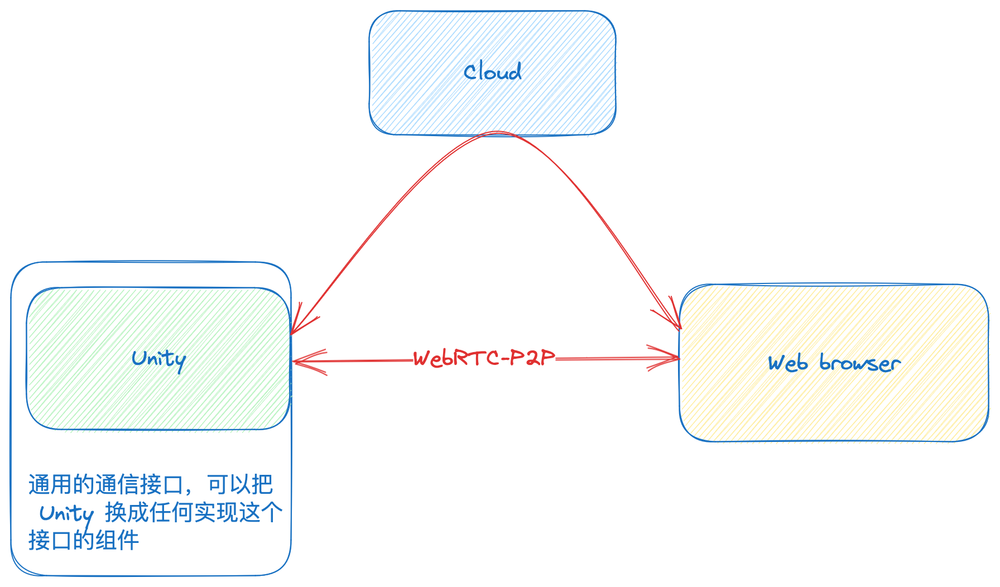

# JoyRTC

You can use this tool to control some devices using WebRTC, but currently only unity

## Architecture



## Run

Use docker run

```bash
docker run --name joyrtc --rm --network host -e TURN_HOSTNAME=turn:turn.22333.fun -e TURN_USERNAME=22333 -e TURN_PASSWORD=22333 ghcr.io/binbat/joyrtc:main
```

### Cloud

```bash
LISTEN=0.0.0.0:8080 go run ./...
```

Environment variables

Variable Name  | Description                                              | Default
-------------- | -------------------------------------------------------- | -------------------------------------------------------------
`LISTEN`       | Server Listen Address                                    | `0.0.0.0:8080`

### WebUI Demo

```bash
npm install
npm run dev
```

### WebComponents

TODO

## Adapter

use Adapter control anything

### Adapter: Light

A RTSP to WebRTC forwarder

```bash
./light -src rtsp://localhost:8554/mystream -server ws://localhost:8080/socket
```

### Adapter: Unity

Unity Version: `2022.1.23f1`

NOTE: Don't use `unity.cn` !!! `unity.cn` version not compatible docker image!!!

Use Unity run

NOTE: Do not use safemode, The first run need auto install websocket-sharp

**Maybe manual install `websocket-sharp`**

```bash
pushd unity/Assets && nuget install && popd
```

Environment variables

Variable Name  | Description                                              | Default
-------------- | -------------------------------------------------------- | -------------------------------------------------------------
`ICE_SERVERS`  | Stun Server Configuration                                |
`TURN_HOSTNAME`| Turn Server Address Configuration                        |
`TURN_USERNAME`| Turn Server Username, Need set `TURN_HOSTNAME`           |
`TURN_PASSWORD`| Turn Server Password, Need set `TURN_HOSTNAME`           |
`SERVER_URL`   | WebSocket Signal Address                                 | `ws://localhost:8080/socket`

